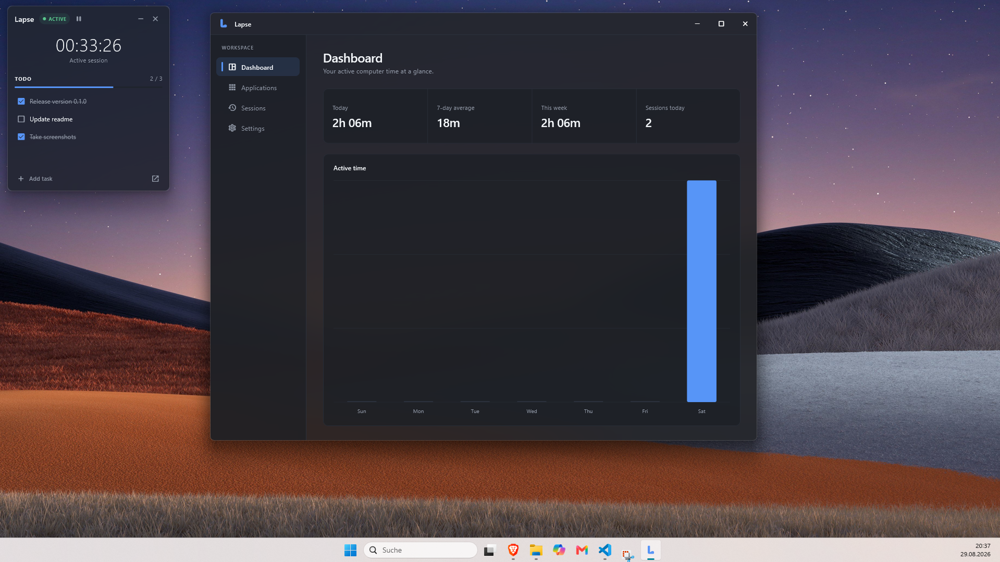
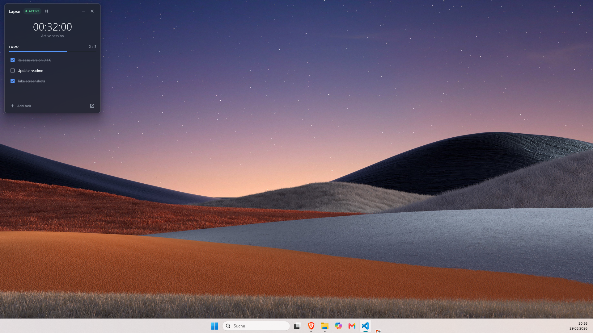
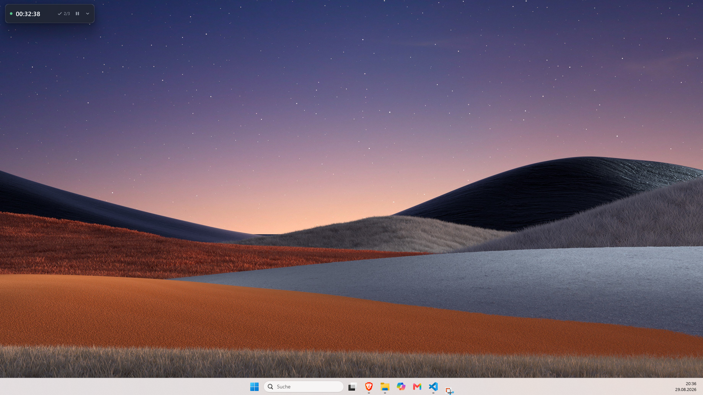

<p align="center">
  
</p>

<h1 align="center">Lapse</h1>

<p align="center">
  A quiet Windows companion for active-time tracking and session-focused tasks.
</p>

<p align="center">
  
  
  
  
</p>

<p align="center">
  Lapse starts tracking automatically, pauses when Windows is idle, locked, or asleep,
  and keeps a small task list close by without getting in your way.
</p>



## Why I built Lapse

I believe Lapse can be a genuinely useful tool because I noticed how helpful it is when a timer starts automatically with the PC. There is nothing to remember or set up at the beginning of a session—the elapsed time is simply there whenever I need it, making it much easier not to lose track of how long I have been at the computer.

## Highlights

- **Accurate active time** — uses monotonic intervals instead of assuming every timer tick arrived on time.
- **Automatic activity awareness** — pauses after five minutes of inactivity and reacts to lock, unlock, sleep, and resume events.
- **Session todo list** — add, complete, edit, and remove the few tasks that matter right now.
- **Two overlay modes** — switch between the full task view and a compact `244 × 52` timer strip.
- **Useful history** — review daily totals, a seven-day overview, recent sessions, and foreground-application usage.
- **Native Windows behavior** — always-on-top support, multi-monitor-safe positioning, autostart, system tray controls, and close-to-tray.
- **Private by design** — all data stays on the device; there are no accounts, cloud sync, or telemetry.

## Designed to stay out of the way

The expanded overlay combines the current session timer with a deliberately small task list. Collapse it when you only need a glance at the timer and progress.

<table>
  <tr>
    <td width="50%" align="center"><strong>Focus view</strong></td>
    <td width="50%" align="center"><strong>Compact view</strong></td>
  </tr>
  <tr>
    <td></td>
    <td></td>
  </tr>
  <tr>
    <td align="center">Timer, session status, progress, and tasks</td>
    <td align="center">Time and progress at a glance</td>
  </tr>
</table>

## Build from source

Lapse currently targets Windows 10 or newer and Flutter's experimental Desktop Windowing API.

### Prerequisites

- [Flutter](https://docs.flutter.dev/get-started/install/windows/desktop) on the `main` channel
- Visual Studio with the **Desktop development with C++** workload
- Windows desktop and experimental windowing support enabled

```powershell
flutter channel main
flutter upgrade
flutter config --enable-windows-desktop
flutter config --enable-windowing
flutter pub get
dart run build_runner build
flutter run -d windows
```

The current project was developed with Flutter `3.48.0-1.0.pre-515` and Dart `3.14.0-179.0.dev` from 29 August 2026.

> [!WARNING]
> Flutter's Desktop Windowing API is experimental. Lapse intentionally follows Flutter's `main` channel, so SDK upgrades may require code changes.

## Data and privacy

Lapse stores its versioned state locally at:

```text
%LOCALAPPDATA%\Lapse\state.json
```

The file contains session time, tasks, application usage summaries, history, and preferences. Application usage is stored as an executable identity, a resolved display name, and cumulative active duration rather than a chronological activity log. Writes are atomic, state is checkpointed every 30 seconds, and same-boot sessions can be recovered after a restart.

## How it is built

The app uses Flutter and Riverpod for its UI and shared session state, with a small native Windows runner bridge for capabilities that the experimental Flutter API does not expose yet.

```text
Flutter UI
├── Overlay window
├── Dashboard window
└── Riverpod session state
    ├── Active-time and application-usage accumulators
    ├── Versioned JSON persistence
    └── Windows platform services
        ├── Activity, lock, and power events
        ├── Foreground application metadata
        └── Tray, autostart, topmost, and window positioning
```

The overlay and dynamically registered Dashboard have separate `WindowController`s while sharing a single session controller and persistence layer.

<details>
  <summary><strong>Experimental Windowing API details</strong></summary>

  Lapse currently uses:

  - `runWidget()` instead of `runApp()`
  - internal `package:flutter/src/widgets/_window.dart`
  - `WindowController`, `WindowControllerDelegate`, and `Window`
  - `WindowManager`, `WindowRegistry`, and `WindowEntry` for the Dashboard
  - `WindowController.setSize()` for overlay resizing

  The two narrow analyzer suppressions around the internal import are intentional until Flutter publishes the API. They are not global analyzer exclusions.
</details>

## Known limitations

- The experimental Windowing API can change between Flutter `main` revisions.
- Native styling currently identifies the overlay and Dashboard by their centrally defined window titles.
- Boot identity uses a rounded Windows boot-time heuristic derived from `GetTickCount64`; a large system-clock correction can conservatively start a fresh session.
- An abrupt process termination can lose the current uncheckpointed interval. Normal close-to-tray and **Quit** actions persist first.
- Lapse is Windows-only.
